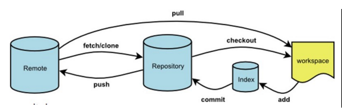

# Git介绍

以下指南基于几个共同的假设：

- 将文档放置在项目的 `docs` 目录中；
- 使用默认的构建输出位置（`.vuepress/dist`）。
- VuePress 是在项目本地的依赖中安装的，并且配置如下的 npm scripts:

``` json
{
  "scripts": {
    "docs:build": "vuepress build docs"
  }
}
```

## Git remote

 * 为了便于管理。Git要求每个远程主机都必须制定一个主机名。git remote命令就是用于管理主机名。
1. git remote  
会列出远程库的名字。在我们clone了刚才的项目之后，默认会看到一个origin的远程仓库。
``` bash{23,24}
Administrator@9GPBSPCCTFQXEUX MINGW64 /e/TestTwo (test)
$ git remote
origin
```
2. git remote -v  
显示出详细的url地址名和对应的别名
``` bash
Administrator@9GPBSPCCTFQXEUX MINGW64 /e/TestTwo (test)

$ git remote -v

origin  git@github.com:zhaoJoeyuan/TestTwo.git (fetch)

origin  git@github.com:zhaoJoeyuan/TestTwo.git (push)
```
3. git remote add name url  
 添加远程仓库，一旦添加以后别名就代表远程库的版本库地址，可以直接使用。   
 git remote add joey git@github.com:zhaoJoeyuan/Test.git

``` bash
Administrator@9GPBSPCCTFQXEUX MINGW64 /e/TestTwo (test)

$ git remote add joey git@github.com:zhaoJoeyuan/Test.git

Administrator@9GPBSPCCTFQXEUX MINGW64 /e/TestTwo (test)

$ git remote -v

joey    git@github.com:zhaoJoeyuan/Test.git (fetch)

joey    git@github.com:zhaoJoeyuan/Test.git (push)

origin  git@github.com:zhaoJoeyuan/TestTwo.git (fetch)

origin  git@github.com:zhaoJoeyuan/TestTwo.git (push)
```
4.  git remote remove name  
删除添加的远程库
git remote remove joey
``` bash
Administrator@9GPBSPCCTFQXEUX MINGW64 /e/TestTwo (test)

$ git remote remove joey

Administrator@9GPBSPCCTFQXEUX MINGW64 /e/TestTwo (test)

$ git remote -v

origin  git@github.com:zhaoJoeyuan/TestTwo.git (fetch)

origin  git@github.com:zhaoJoeyuan/TestTwo.git (push)
``` 
5. git remote rename 原名字 新名字  
 git remote rename origin joey
``` bash
Administrator@9GPBSPCCTFQXEUX MINGW64 /e/TestTwo (test)

$ git remote rename origin joey

Administrator@9GPBSPCCTFQXEUX MINGW64 /e/TestTwo (test)

$ git remote -v

joey    git@github.com:zhaoJoeyuan/TestTwo.git (fetch)

joey    git@github.com:zhaoJoeyuan/TestTwo.git (push)

```
6. git remote show 主机名  
查看指定主机的详细信息：  
总的来说就是git  remote +各种不同的参数来做不同的操作  
 git remote show joey  
``` bash 
Administrator@9GPBSPCCTFQXEUX MINGW64 /e/TestTwo (test)
$ git remote show joey
* remote joey
  Fetch URL: git@github.com:zhaoJoeyuan/TestTwo.git
  Push  URL: git@github.com:zhaoJoeyuan/TestTwo.git
  HEAD branch: master
  Remote branches:
    TestTTT             new (next fetch will store in remotes/joey)
    master              tracked
    zhaoJoeyuan-patch-1 tracked
  Local branch configured for 'git pull':
    master merges with remote master
  Local ref configured for 'git push':
    master pushes to master (fast-forwardable)
```
 
***

> 原文：[https://blog.csdn.net/zy00000000001/article/details/70505150](https://blog.csdn.net/zy00000000001/article/details/70505150)
·